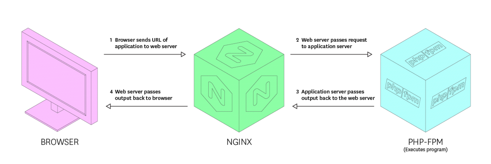

## Overview Architecture

 

## References
1. https://www.youtube.com/watch?v=BBRS-8leLKc&feature=emb_rel_pause
2. https://www.youtube.com/watch?v=OrYQO57ygqY&list=PLg_ebwHzOGoyXglqch5mbBjDKesSPJyKp&index=3
3. https://serverpilot.io/docs/how-to-install-the-php-sqlsrv-extension/
4. https://www.php.net/manual/en/book.pdo.php
5. https://www.php.net/manual/en/book.mysqli.php

## Todos
1. docker php image for prod.
2. https://www.youtube.com/watch?v=r_9PnDWPl6s
3. https://geekflare.com/php-fpm-optimization/#:~:text=The%20%E2%80%9CFPM%E2%80%9D%20part%20in%20PHP,by%20this%20FPM%20process%20manager.
4. https://www.elastic.co/guide/en/logstash/current/config-examples.html
5. logstash conf must be added to docker-compose
6. pipeline

